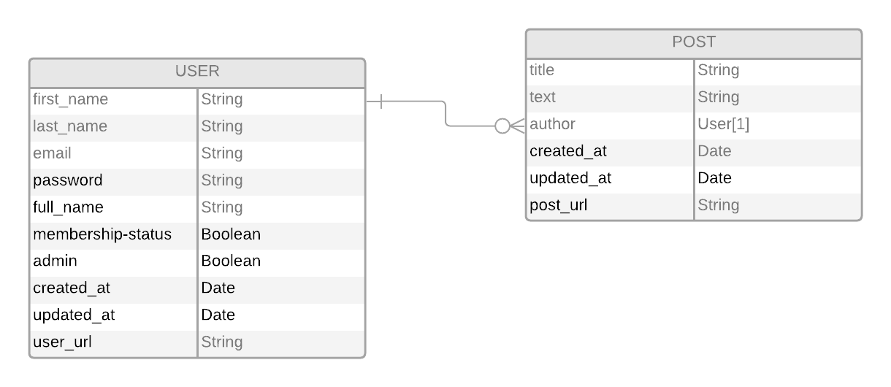

# PROJECT: Only Members by Nodejs

In this project I’ll be building an exclusive clubhouse where members can write embarrassing posts. Inside the clubhouse, members can see who the author of a post is, but outside they can only see the story and wonder who wrote it.

I will use my authentication skills learned, and also I will be practicing my database.

## Live Demo

[Live Demo Link]() .

## Built With
- Node.
- Express.js.
- Passport.js.
- bcrypt.js.
- Npm.
- Html.
- CSS.
- Bulma.
- EJS.
- MongoDB.

## Features:

- Everyone could sign up.
- All members could login using their emails and passwords.
- Only memebers could see the posts' authors.
- Only memebers could see the posts' created at.
- It includes all of the CRUD methods for posts, so anybody that’s visiting the site can Create, Read, Update or Delete their own posts.
- Admin has the ability to see all authors and permitted to delete all messages.

## Security
- Protected from Cross site request forgery(csrf) using CSURF npm package.
- Protected from Cross site scripting(xss) and injection by validating and sanitization the data.
- Passwords are secured with bcrypt.js.
- Cookies used for http only (not allowed for browser JavaScript).
- Cookies are destroyed after logout(ephemeral cookies).
- protected from DoS attacks by using the Rate limiting. The rate of requests that the server can receive from a specific user and / or IP address is controled.
- Set various HTTP headers, change default headers values or hide others by using Helmet.

## Future features
- Implement Json Web Token (JWT) authorization system.
- Add beautiful langing page.  

### Prerequisites

1. Git.
2. Code editor.
3. browser.
4. Node.

## How to run the program

### On your local machine:

1. Open your terminal.

2. Enter `git clone https://github.com/othman-19/only-members-nodejs`.

3. Navigate to the cloned repository.

4. In the terminal cd into Inventory-app-expressjs.

5. Run `npm install` in your terminal.

6. Run `npm run serverstart` or `DEBUG=only-members-nodejs:* npm run devstart` in your terminal.

7. In your browser try this url: `http://localhost:3000/`.

8. Try subscribe, create posts, become a member or an admin.

## Author(s)
[Othmane Namani](https://github.com/othman-19/).  
[Email: othmanenaamani@gmail.com](mailto:othmanenaamani@gmail.com).  
[Portfolio](https://othman-19.github.io/my_portfolio/).  
[LinkedIn](https://www.linkedin.com/in/othman-namani/).  
[twitter](https://twitter.com/ONaamani).  
[DEV Community](https://dev.to/othman).  
[Angel List](https://angel.co/othmane-namani).  

## 🤝 Contributing

Contributions, issues and feature requests are welcome!

Feel free to check the [issues page](issues/).

## Show your support

Give a ⭐️ if you like this project!

